[ **Hermite-FEP**]{style="color: white"}\
[ **User Manual**]{style="color: white"}\
[ **\
Version: 0.2.2**]{style="color: white"}

Overview
========

Hermite is a chemical simulation software for use in pharmaceutical and
biotechnology research. Major features of Hermite include protein
preparation, ligand preparation, docking, vritual screening, molecule
generator, similarity search, molecular clustering, ADME/Toxicity and
QSAR . Potential applications of Hermite include free energy
perturbation (FEP), binding site prediction, structure prediction,
homology modeling, ligand design and etc .

Hermite GUI
-----------

The Hermite GUI has a wide range of features and tools. As shown in Fig.
1.1, the Hermite main window consists of Title Bar, Menu Bar, Toolbar,
Pipeline, Entry list, Information Bar, Command Input Area and Workspace.
All these features are listed below.

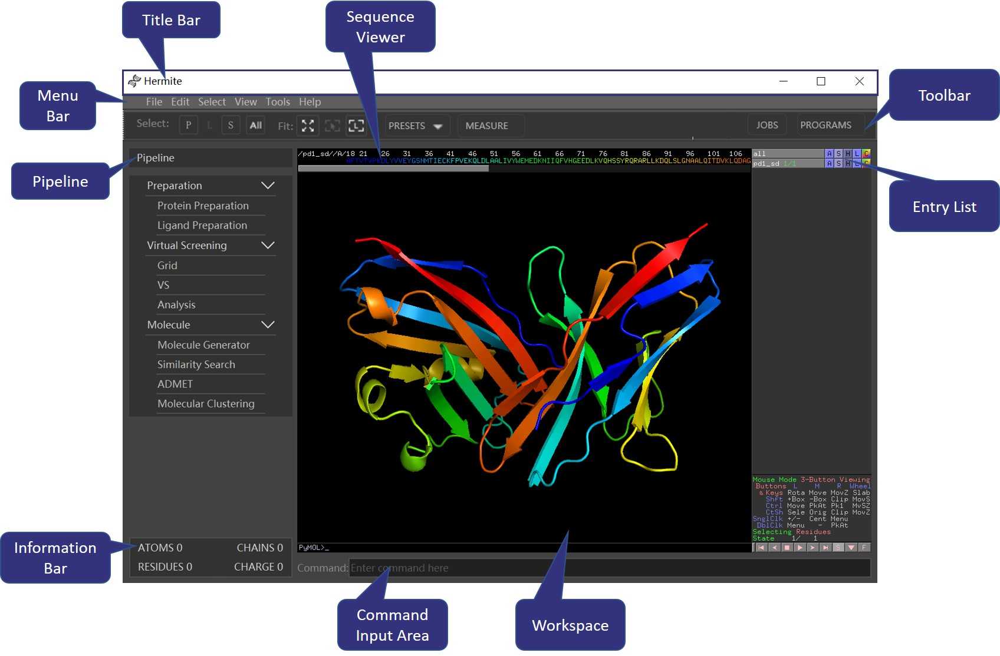{width="100%"}

**Figure 1.1** Hermite GUI.

Hermite GUI
-----------

The Hermite-FEP module is implemented within Hermite, and can be invoked
by clicking the "Free Energy Perturbation\".

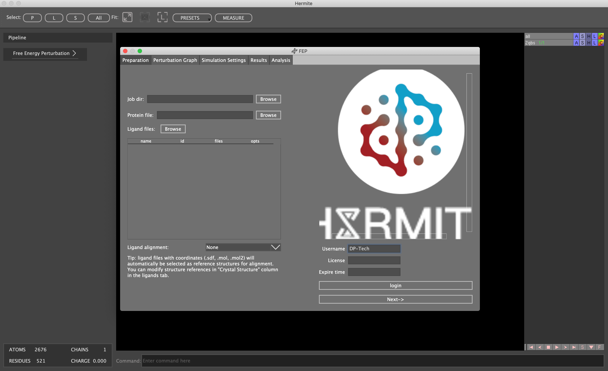{width="76%"}

**Figure 1.2** Hermite-FEP GUI.

Basic Theory in FEP
-------------------

Accurate *in silico* prediction of protein-ligand binding affinities has
been a primary objective of structure-based drug design. With the
development of combinations of force fields, sampling techniques, deep
learning and high performance computers, the binding free energy
calculations have shown significant promise in reliably generating
accurate predictions in the context of drug discovery projects.

Here, we focus on the scenario where one ligand molecule forms a
reversible noncovalent complex with the biological unit of a
macro-molecule at thermodynamic equilibrium with the unbound molecules
in solution. The free energy difference between these two end points can
be computed by
$$RT \ln(K_D) = \Delta G = - RT \ln \frac{Z_{\rm complex} }{ Z_{\rm solvated}}$$

However, this method faces the problem of sampling difficulty, due to
the huge difference of transformation. Consequently, now we turn to
calculating the relative binding free energy. Within this context, a
simplification can be introduced to reduce the amount of sampling
needed:

$$\begin{aligned}
%    RT ln(K_D) = \Delta G = - RT ln \frac{Z_{complex} }{ Z_{solvated}}
\Delta \Delta G_{\rm A,B} & = \Delta G_{\rm B} - \Delta G_{\rm A} \\
& = -RT \ln  \frac{Z_{\rm complex}^{\rm B} Z_{\rm solvated}^{\rm A} }{Z_{\rm complex}^{\rm A} Z_{\rm solvated}^{\rm B}} \\
& = \Delta G_{\rm A,B\, complex} - \Delta G_{\rm A,B\, solvated}\end{aligned}$$

Then, we use the Free Energy Perturbation (FEP) method to evaluate
$\Delta G_{\rm A,B\, complex}$ and $\Delta G_{\rm A,B\, solvated}$,
respectively. Suppose there is an alchemical path which transforms $a$
to $b$, and denoted by $\lambda \in \{0,1\}$. The Hamiltonian $H$ and
free energy $G$ along the path can be evaluated by interpolation:

$$\begin{aligned}
    H(\lambda) & = \lambda H_{\rm A} + (1- \lambda) H_{\rm B} \\
    G(\lambda) & = -\frac{1}{\beta} \ln \int e^{-\beta H(\lambda)} dx\end{aligned}$$

Then $G(0) = G_{\rm A}$ and $G(1) = G_{\rm B}$. The free energy
differences between \"A\" and \"B\" can be obtained
$$\Delta G_{\rm A, B}  = G(1) - G(0) = \int_0^1 \frac{d G(\lambda)}{d \lambda} d \lambda 
%= \int_0^1 <\frac{d H }{d \lambda}>_\lambda d \lambda
\label{free_energy}$$

We use the multistate Bennett acceptance ratio (MBAR) method to evaluate
Eq.([\[free_energy\]](#free_energy){reference-type="ref"
reference="free_energy"}). If
$\Delta \Delta G = \Delta G_{\rm B} - \Delta G_{\rm A} < 0$, then the
ligand B is favored over A by the protein. Thus, by comparing relative
free energies among all ligands, we can sort their binding affinity.

We perform Molecular Dynamics to sample possible configurations and
evaluate the ensemble. To enhance the sampling efficiency, we apply
Replica Exchange with Solute Tempering (REST2).

Installation
============

For windows users, download the package and unzip it, you may find a
folder `exe.win-amd64-3.7`. Enter it, verify your configurations in
`config.json`.

For linux uses, you should first install such a package.

    apt install libglvnd-dev

Then, download the package and uncompress it. You may find a folder
`exe.linux-x86\_64-3.7`.

Enter it, verify your configurations in `config.json`.

Below configuration is used to submit to DP-CloudServer.

    {
        "username": "USERNAME",
        "password": "PASSWORD",
        "license": "LICENSE",
        "jobs": "",
        "working_path": "",
        "base_url": "http://cloudserver.deepmd.net",
        "endpoint" : "http://oss-cn-shenzhen.aliyuncs.com",
        "bucket" : "dpcloudserver",
        "login_url" : "http://cloudserver.deepmd.net",
        "upload_channel": "oss",
        "web_server" : "cloudserver",
        "machine_settings":
           {
               "is_root" : true,
               "is_hot_update" : false,
               "is_download_all_prep" : true,
               "is_download_log" : true,
               "env_prepare" : "/root/env/gmx_2020.2_gpuall_021721.env",
               "env_simulation" : "/root/env/gmx_2020.2_gpuall_021721.env",
               "server_feprep" : "/root/Hermite-fep/FEprep"
           }
    }

[Notes: If you do not have an account, you may register at
http://cloudserver.deepmd.net. The connection to
http://cloudserver.deepmd.net is necessary, which is used only for
checking license and will not receive any input files.
]{style="color: blue"}

[Notes: Each client owns a unique license for submitting jobs. If you
change computer to run Hermite-fep, you should change license
accordingly.]{style="color: blue"}

In this tutorial, we will use **tnks2** from Merck's benchmark as an
example.

Usage
=====

Login and preparation
---------------------

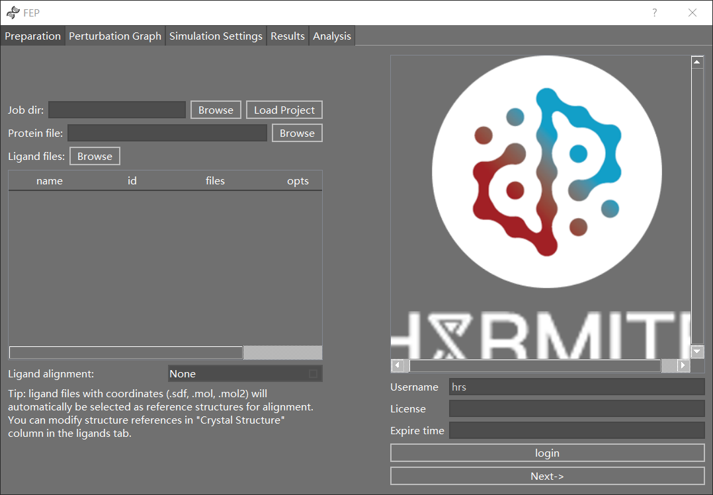{width="90%"}

1.  Complete your username and click `login`. [Notes: Login is
    necessary, otherwise you cannot submit fep
    jobs.]{style="color: blue"}

2.  Click `Browse` in the `Job dir` part and choose a folder as working
    directory.

    [Notes: We recommend that you use a blank folder in your first
    try.]{style="color: blue"}

3.  (Optional) Click `Load Project` to choose a folder with all prepared
    files (which is built in a former preparation, or a downloaded
    folder), this will skip preparation steps (up to 3.4)and you can
    submit job directly.

4.  Click `Browse` in the `Protein file` part and choose `protein.pdb`
    to load the protein structure.

    [Notes: Here, `.pdb` format is expected. It's strongly suggested
    that the protein file is properly prepared, without missing atoms,
    broken chains, and reagent molecules in crystallization like
    $\rm CH_3OH$ and $\rm HCO_3^-$. ]{style="color: blue"}

5.  Click `Browse` in the `Ligand files` part and choose ligand files to
    load.

    [`.sdf` and `.mol` formats are prefered. You can either load them
    from separate files or from one file containing a series of ligands.
    ]{style="color: blue"}

6.  Click `Next ->` and go to the `Perturbation Graph` part.\
    [Notes: The `Next ->` button should be clicked before entering next
    step!]{style="color: blue"}

Build the Perturbation Graph
----------------------------

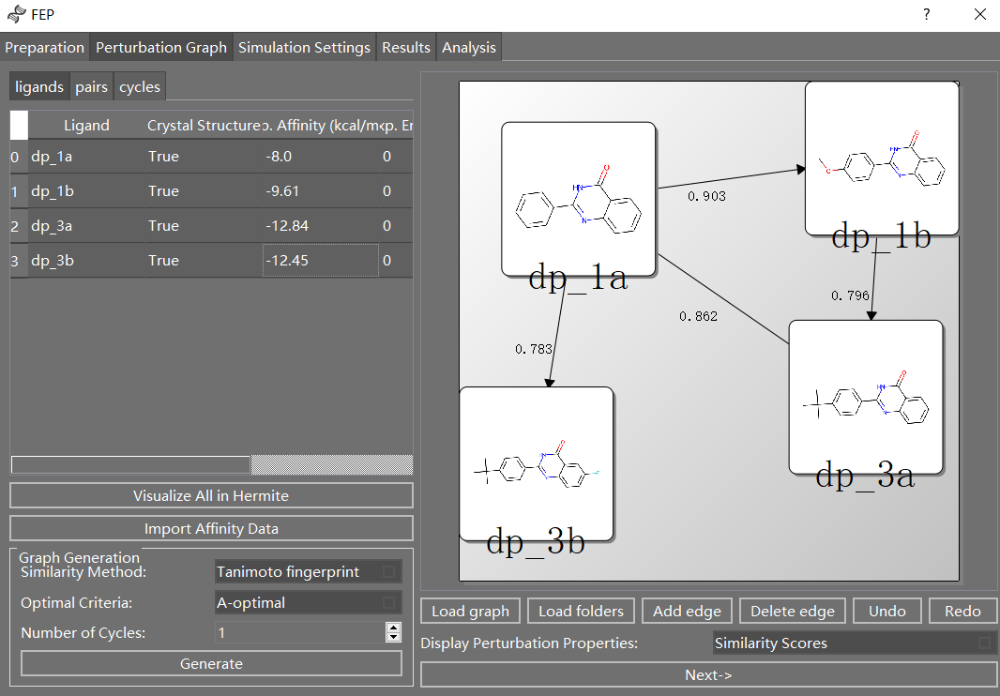{width="90%"}

1.  Build the perturbation graph. There are two ways. First, you can
    choose the number of cycles and click `Generate` in the lower left.
    Second, you can load the graph from an existing file, in which each
    line is composed of two ligand names joint with a space. You can
    click `Load graph`.

    [Notes: Each edge on the graph corresponds to one relative free
    energy calculation. And the arrow points from the start ligands to
    the end ligands. The value on the edge is related to the similarity
    of molecules.]{style="color: blue"}

2.  Modify the perturbation graph. After a graph is generated, you can
    modify the graph by adding or deleting edges.

3.  (Optional) Import Experimental Data. If your ligand files contain
    experimental affinity data, it will be loaded automatically by
    Hermite-FEP. The sdf files should contain `> <IC50[uM]> `,
    `> <IC50[nM]>`, or `> <exp>` (in kcal/mol) keywords and values. Or
    you can click `Import Affinity Data` to import a `.csv` file to load
    experimental data. The `.csv` file you import should contain 3
    columns. The 1st column is the ligand name (the same to your ligand
    filename), 2nd column the affinity, and 3rd column the experimental
    error.

4.  (Optional) Check the overlap between loaded ligands in 2D
    perspective on the right **or** in the 3D perspective on the Hermite
    viewer by clicking `Visualize All in Hermite`. (See demo in next
    page)

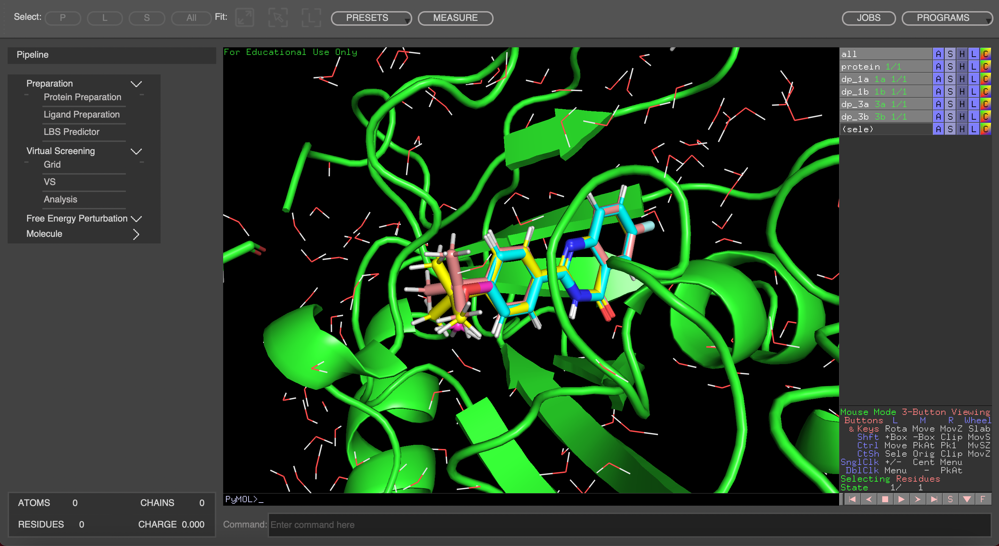{width="90%"}

Visualize and Modify Perturbation Graph
---------------------------------------

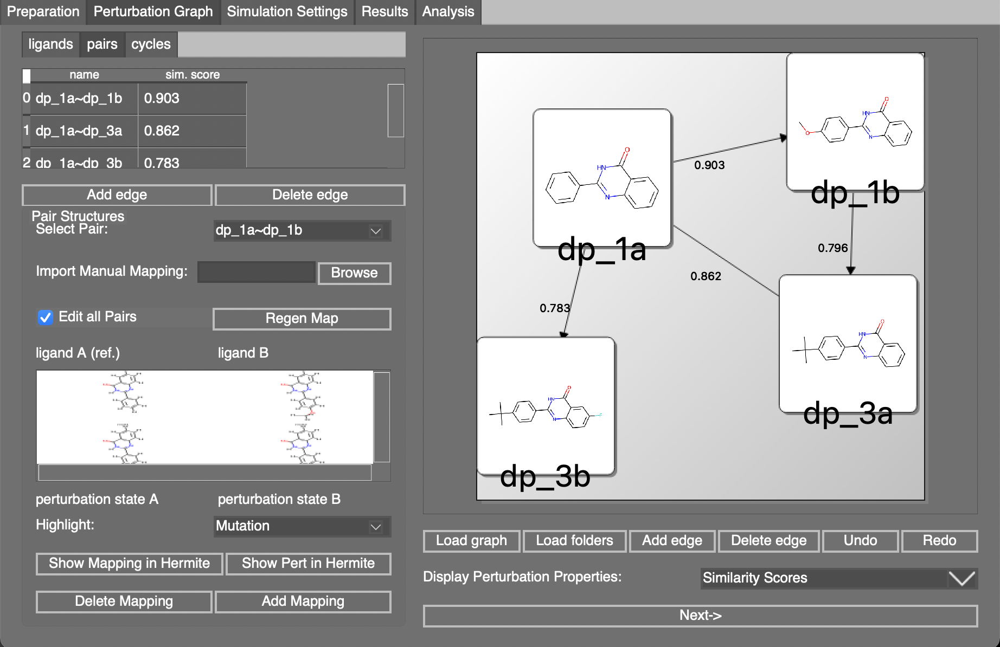{width="90%"}

1.  (Optional) Click tab `Pairs` and the details of each pair of
    relative free energy calculation are showed.

2.  (Optional) Select a ligand pair of interest from combo-box
    `Select Pair`.

3.  (Optional) Check the atom-by-atom mapping relationship for selected
    pair on the Hermite viewer by clicking `Show Mapping in Hermite`.

    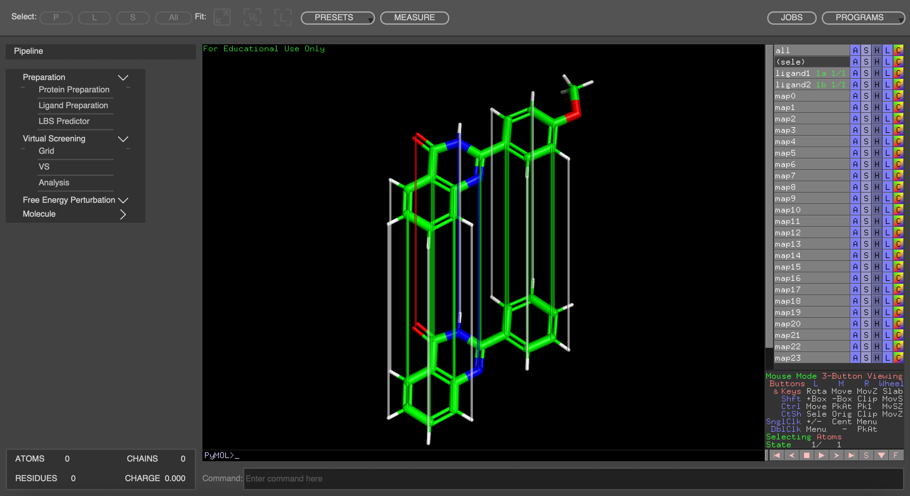{width="90%"}

4.  Check the atom-by-atom mapping of perturbation between pairs on the
    Hermite viewer by clicking `Show Pert in Hermite`.

    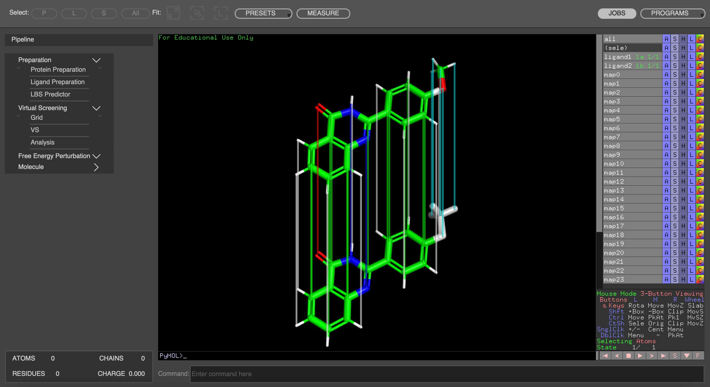{width="90%"}

5.  (Optional) Modify the perturbation graph by clicking ligand pair on
    the right window and then click `Add edge` and Delete edge button.

6.  Click `Next ->` to the next part, designating parameters for MD.

    [Notes: The `Next ->` button should be clicked before entering next
    step!]{style="color: blue"}

Designating Parameters for MD
-----------------------------

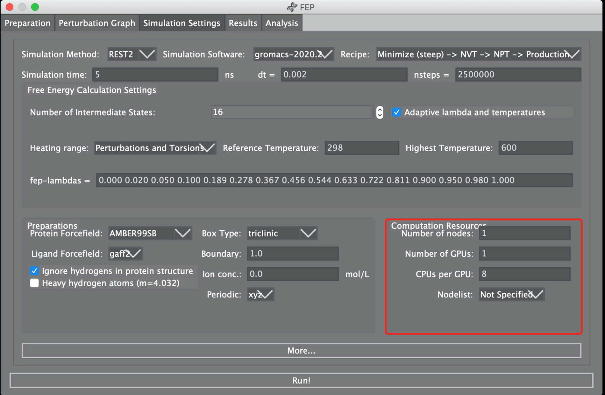{width="90%"}

1.  Enter the `Simulation time` and `dt` in the corresponding boxes.

    [Notes: `Simulation time` is the total time that you want to
    stimulate for the system (per lambda), and `dt` (unit: ps) is the
    time step in the time evolution process. Then the steps of molecular
    dynamics can be determined. ]{style="color: blue"}

2.  Modify other parameters which are consistent with those adopted by
    Gromacs.

    [Notes: If you are not familiar with these parameters, you can use
    the defaulted parameters. `Adaptive lambda and temperatures` means
    that we will perform an extra short simulation to optimize these two
    parameters. Otherwise, if you want to quick-test, you can choose
    not. ]{style="color: blue"}

3.  Specify computation resources. You can specify the number of GPUs
    and CPUs for each FEP pair and the name of node you want to use. If
    you choose `Not specified` in `Nodelist`, all nodes can be
    candidates for running FEP. If you submit to DP-CloudServer, you may
    ignore this settings.

4.  Click `Run` and the FEP job will be submitted. Click `Results` tab
    to monitor the job status.

Monitor Job Status
------------------

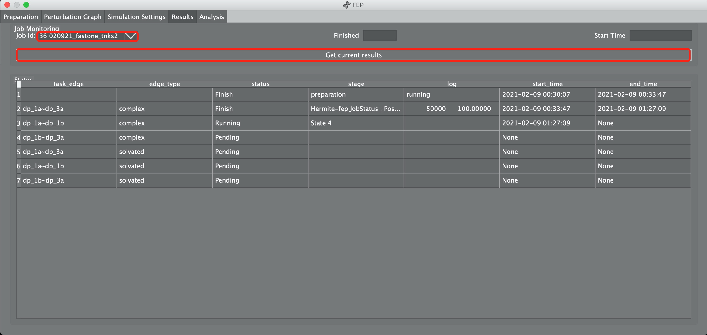{width="90%"}

1.  Click `Job ID` to choose the job to monitor. The first string is the
    unique `Job ID` and the second is your project name, which is the
    name of the `Job dir` folder you browsed in preparation.

2.  Click `Get current results` to obtain the processing information of
    the job. You may see only one line at your first glance. The first
    line denotes the preparation for forcefield parameters. Usually this
    step needs several minutes for each ligand.

3.  After some time, click `Get current results` again. You may see all
    calculations of FEP pairs have been started. Possible status
    includes `Pending`, `Running` and `Finish`. You can also see the
    start time and end time for each job.

4.  Click `Get current results` when all jobs are finished.

    [Notes: all results are downloaded into the folder
    `Hermite\_home/lib/viewer/download`. You may find some subfolders in
    it , each with a unique job-id.]{style="color: blue"}

Results and Analysis
--------------------

1.  You can see the summary for prediction of each ligand and the
    correlation plot (if there is experimental affinity data) in
    `Overview`.

    {width="65%"}

2.  In the tab `Pair Results`, you can see the prediction of the
    relative free energy of each perturbation, with mean and average
    provided. The unit is in kcal/mol.

    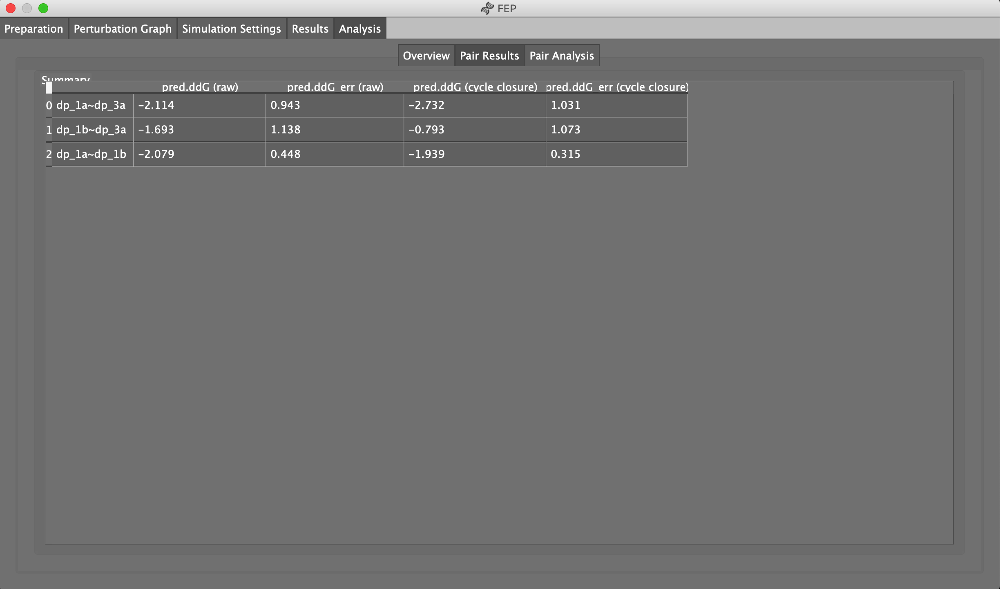{width="65%"}

3.  In the tab `Pair Analysis`, you can select a pair of interest and
    visualize the convergence of results.

    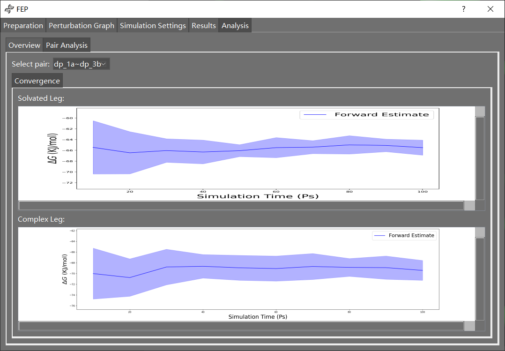{width="65%"}
